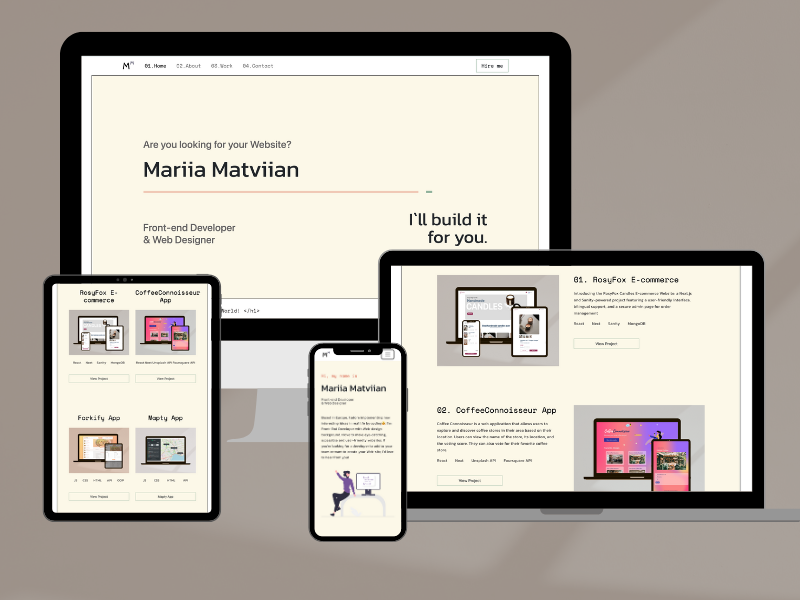

# My Portfolio 👩‍💻

Welcome to my portfolio! This portfolio showcases my skills and experiences as a developer. You will find information about my projects, a little about me, and how to get in touch.

## Features

- Clean and modern design
- Responsive layout for optimal viewing on various devices
- Showcase of projects with project descriptions and links
- Skills section highlighting my technical expertise
- Contacts for communucation

## Technologies Used

- HTML: Markup language for structuring the content
- CSS: Styling language for enhancing the design and layout
- JavaScript: Programming language for adding interactivity and functionality
- Bootstrap: CSS framework for responsive and mobile-first design

